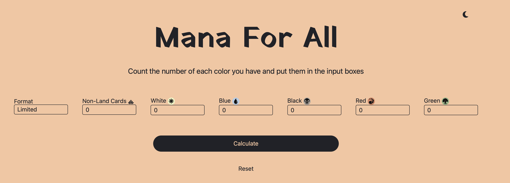

# Mana For All!
Quick not complicated MTG Mana Calculator. ⚪ 🔵 ⚫ 🔴 🟢

## About

Have you found yourself at a pre-release and need to quickly figure out how many land you need?

LOOK. NO. FURTHER. 👀

This site can help you quickly generate the correct amount of land you need for your pre-release or limited deck!

## 🧞 Commands

All commands are run from the root of the project, from a terminal:

| Command                   | Action                                           |
| :------------------------ | :----------------------------------------------- |
| `npm install`             | Installs dependencies                            |
| `npm run dev`             | Starts local dev server at `localhost:4321`      |
| `npm run build`           | Build your production site to `./dist/`          |
| `npm run preview`         | Preview your build locally, before deploying     |
| `npm run astro ...`       | Run CLI commands like `astro add`, `astro check` |
| `npm run astro -- --help` | Get help using the Astro CLI                     |
